# Diagrama UML - Patrón Abstract Factory para Restaurantes

## Estructura del Patrón

```mermaid
classDiagram
    %% Productos Abstractos
    class PlatoFuerte {
        <<abstract>>
        -String nombre
        -String descripcion
        +PlatoFuerte(nombre, descripcion)
        +servir()*
        +getNombre() String
        +getDescripcion() String
    }
    
    class Bebida {
        <<abstract>>
        -String nombre
        -String descripcion
        +Bebida(nombre, descripcion)
        +servir()*
        +getNombre() String
        +getDescripcion() String
    }
    
    class Postre {
        <<abstract>>
        -String nombre
        -String descripcion
        +Postre(nombre, descripcion)
        +servir()*
        +getNombre() String
        +getDescripcion() String
    }
    
    %% Fábrica Abstracta
    class FabricaRestaurante {
        <<abstract>>
        +crearPlatoFuerte() PlatoFuerte*
        +crearBebida() Bebida*
        +crearPostre() Postre*
        +crearMenu() Menu
    }
    
    %% Productos Concretos - Cocina China
    class ChowMein {
        +ChowMein()
        +servir()
    }
    
    class TeJazmin {
        +TeJazmin()
        +servir()
    }
    
    class RollitoDulce {
        +RollitoDulce()
        +servir()
    }
    
    %% Productos Concretos - Cocina Japonesa
    class Ramen {
        +Ramen()
        +servir()
    }
    
    class Sake {
        +Sake()
        +servir()
    }
    
    class Dango {
        +Dango()
        +servir()
    }
    
    %% Productos Concretos - Cocina Mexicana
    class TacosCarneAsada {
        +TacosCarneAsada()
        +servir()
    }
    
    class AguaJamaica {
        +AguaJamaica()
        +servir()
    }
    
    class PastelTresLeches {
        +PastelTresLeches()
        +servir()
    }
    
    %% Productos Concretos - Cocina Italiana
    class Pizza {
        +Pizza()
        +servir()
    }
    
    class Vino {
        +Vino()
        +servir()
    }
    
    class Tiramisu {
        +Tiramisu()
        +servir()
    }
    
    %% Productos Concretos - Cocina India
    class Curry {
        +Curry()
        +servir()
    }
    
    class Lassi {
        +Lassi()
        +servir()
    }
    
    class GulabJamun {
        +GulabJamun()
        +servir()
    }
    
    %% Fábricas Concretas
    class FabricaRestauranteChino {
        +crearPlatoFuerte() ChowMein
        +crearBebida() TeJazmin
        +crearPostre() RollitoDulce
    }
    
    class FabricaRestauranteJapones {
        +crearPlatoFuerte() Ramen
        +crearBebida() Sake
        +crearPostre() Dango
    }
    
    class FabricaRestauranteMexicano {
        +crearPlatoFuerte() TacosCarneAsada
        +crearBebida() AguaJamaica
        +crearPostre() PastelTresLeches
    }
    
    class FabricaRestauranteItaliano {
        +crearPlatoFuerte() Pizza
        +crearBebida() Vino
        +crearPostre() Tiramisu
    }
    
    class FabricaRestauranteIndio {
        +crearPlatoFuerte() Curry
        +crearBebida() Lassi
        +crearPostre() GulabJamun
    }
    
    %% Clase de Soporte
    class Menu {
        -PlatoFuerte platoFuerte
        -Bebida bebida
        -Postre postre
        +Menu(platoFuerte, bebida, postre)
        +servirMenu()
        +getInfo() Object
    }
    
    %% Cliente
    class Cliente {
        -FabricaRestaurante fabrica
        +iniciar()
        +probarDiferentesFabricas()
    }
    
    %% Relaciones de Herencia
    ChowMein --|> PlatoFuerte
    Ramen --|> PlatoFuerte
    TacosCarneAsada --|> PlatoFuerte
    Pizza --|> PlatoFuerte
    Curry --|> PlatoFuerte
    
    TeJazmin --|> Bebida
    Sake --|> Bebida
    AguaJamaica --|> Bebida
    Vino --|> Bebida
    Lassi --|> Bebida
    
    RollitoDulce --|> Postre
    Dango --|> Postre
    PastelTresLeches --|> Postre
    Tiramisu --|> Postre
    GulabJamun --|> Postre
    
    %% Relaciones de Herencia de Fábricas
    FabricaRestauranteChino --|> FabricaRestaurante
    FabricaRestauranteJapones --|> FabricaRestaurante
    FabricaRestauranteMexicano --|> FabricaRestaurante
    FabricaRestauranteItaliano --|> FabricaRestaurante
    FabricaRestauranteIndio --|> FabricaRestaurante
    
    %% Relaciones de Creación
    FabricaRestauranteChino --> ChowMein : crea
    FabricaRestauranteChino --> TeJazmin : crea
    FabricaRestauranteChino --> RollitoDulce : crea
    
    FabricaRestauranteJapones --> Ramen : crea
    FabricaRestauranteJapones --> Sake : crea
    FabricaRestauranteJapones --> Dango : crea
    
    FabricaRestauranteMexicano --> TacosCarneAsada : crea
    FabricaRestauranteMexicano --> AguaJamaica : crea
    FabricaRestauranteMexicano --> PastelTresLeches : crea
    
    FabricaRestauranteItaliano --> Pizza : crea
    FabricaRestauranteItaliano --> Vino : crea
    FabricaRestauranteItaliano --> Tiramisu : crea
    
    FabricaRestauranteIndio --> Curry : crea
    FabricaRestauranteIndio --> Lassi : crea
    FabricaRestauranteIndio --> GulabJamun : crea
    
    %% Composición del Menu
    Menu *-- PlatoFuerte : contiene
    Menu *-- Bebida : contiene
    Menu *-- Postre : contiene
    
    %% Cliente usa Fábrica
    Cliente ..> FabricaRestaurante : utiliza
```

## Explicación del Diagrama

### Componentes del Patrón Abstract Factory

#### 1. Productos Abstractos (Abstract Products)
- **PlatoFuerte**: Define la interfaz para todos los platos principales
- **Bebida**: Define la interfaz para todas las bebidas
- **Postre**: Define la interfaz para todos los postres

#### 2. Productos Concretos (Concrete Products)
- **Cocina China**: ChowMein, TeJazmin, RollitoDulce
- **Cocina Japonesa**: Ramen, Sake, Dango
- **Cocina Mexicana**: TacosCarneAsada, AguaJamaica, PastelTresLeches
- **Cocina Italiana**: Pizza, Vino, Tiramisu
- **Cocina India**: Curry, Lassi, GulabJamun

#### 3. Fábrica Abstracta (Abstract Factory)
- **FabricaRestaurante**: Define la interfaz para crear familias de productos

#### 4. Fábricas Concretas (Concrete Factories)
- **FabricaRestauranteChino**: Crea productos chinos
- **FabricaRestauranteJapones**: Crea productos japoneses
- **FabricaRestauranteMexicano**: Crea productos mexicanos
- **FabricaRestauranteItaliano**: Crea productos italianos
- **FabricaRestauranteIndio**: Crea productos indios

#### 5. Clases de Soporte
- **Menu**: Contiene y gestiona un conjunto completo de productos
- **Cliente**: Utiliza las fábricas para crear menús

### Flujo de Interacción

1. **Cliente** solicita una fábrica específica
2. **Fábrica Concreta** crea los productos correspondientes
3. **Menu** agrupa los productos relacionados
4. **Cliente** utiliza el menú sin conocer detalles de implementación

### Beneficios del Patrón

#### Ventajas:
- **Desacoplamiento**: Cliente no depende de clases concretas
- **Consistencia**: Productos de la misma familia son compatibles
- **Flexibilidad**: Fácil agregar nuevas cocinas
- **Mantenimiento**: Cambios localizados

#### Extensibilidad:
- Para agregar una nueva cocina: solo se necesitan nuevos productos y una nueva fábrica
- El código del cliente permanece sin cambios
- Las cocinas existentes no se afectan

### Estadísticas del Sistema

| Elemento | Cantidad |
|----------|----------|
| Productos Abstractos | 3 |
| Productos Concretos | 15 |
| Fábricas Abstractas | 1 |
| Fábricas Concretas | 5 |
| Cocinas Implementadas | 5 |

### Cocinas Disponibles

#### Cocina China
- Chow Mein
- Té Jazmín
- Rollito Dulce

#### Cocina Japonesa
- Ramen
- Sake
- Dango

#### Cocina Mexicana
- Tacos de Carne Asada
- Agua de Jamaica
- Pastel de Tres Leches

#### Cocina Italiana
- Pizza Margherita
- Vino Tinto Chianti
- Tiramisú

#### Cocina India
- Chicken Curry
- Lassi de Mango
- Gulab Jamun

### Implementación Dual

El patrón está implementado en dos plataformas:

#### Backend JavaScript
- Clases ES6 con herencia
- Interacción por consola
- Demostración pura del patrón

#### Frontend React
- Componentes React modernos
- Interfaz visual interactiva
- Material-UI y animaciones

### Notación UML Utilizada

- `<<abstract>>`: Clases abstractas
- `*`: Métodos abstractos
- `--|>`: Herencia
- `-->`: Dependencia/creación
- `*--`: Composición
- `..>`: Uso

---

**Este diagrama muestra la implementación completa del patrón Abstract Factory con 5 cocinas diferentes, demostrando la flexibilidad y escalabilidad del patrón de diseño.**
